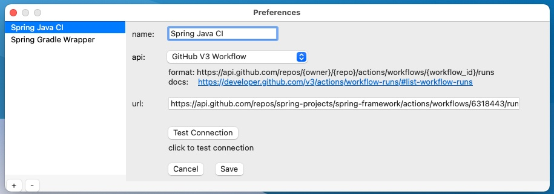

# CI Status Bar
CI Status Bar is a MacOS menu bar app that displays the status of your CI builds.

### Build and Run locally
- `carthage bootstrap`
- run the `cistatusbar` scheme in XCode.

### Tests
Run all tests with:
- `make test`

Run target-specific tests with:
- `make test-unit` for all basic Swift tests in the `UnitTests` target
- `make test-view` for the SwiftUI tests using ViewInspector in the `ViewTests` target
- `make test-e2e` for the end-to-end happy path test in the `E2ETests` target

### Adding a new API
Follow these steps to contribute a new API.
Refer to the existing solutions at `cistatusbar/api/supportedApis/` and `cistatusbarTests/api/supportedApis/` as reference.

1. Name your solution. The format should be like `<service-name>V<version-number><response-type>` in camel case.
   eg. `githubV3Workflow`
2. Add a test file at `cistatusbarTests/api/supportedApis/<name-of-your-solution>/<name-of-your-solution>Tests.swift` that inherits `AbstractResponseTests`
3. Add your solution to the `ApiType` enum located at `/api/ApiType.swift`, positioned in alphabetical order. 
4. Define a struct with your solution name in  the `/api/supportedApis/` group. The struct should have inner structs that implement the protocols defined in `/api/ApiProtocols.swift`
5. Update the struct's Target Membership so that it is included in the `cistatusbarTests` target in addition to the `cistatusbar` target 
6. In your test files, implement functions that require overriding. Running an empty test class that inherits `AbstractResponseTests` will throw errors that explain next steps.
7. Add sample json files for `success`, `running`, `unknown`, `fail`. They must be named in the format `<name-of-your-solution>Tests_SuccessResponse.json`
8. Complete the implementation so all tests pass. Tests should be run using the `UnitTests` or `cistatusbar` schemes.
9. Add your `ApiType` to the private `decodeResponse` method in `RunHttpClientImpl`.
